# Fine-Grained Access Control (FGAC) Data Agent

This project demonstrates Fine-Grained Access Control using Agentcore, Cognito Identity Pool for role mapping and Lake Formation Tag-Based Access Control (TBAC) for data filtering.

## Architecture Overview

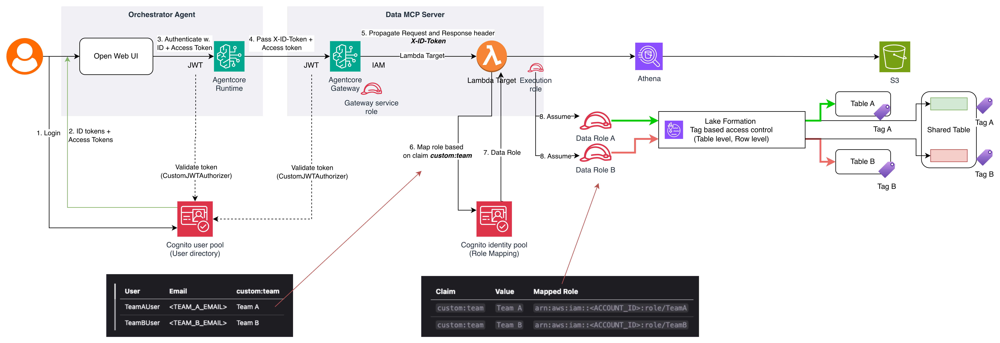

```
User → Cognito Auth → AgentCore Runtime → Gateway → Target Lambda → Identity Pool → IAM Role → Athena (TBAC)
```

### Flow Summary

1. User authenticates with Cognito User Pool, receives Access Token + ID Token
2. User invokes AgentCore Runtime with tokens in headers
3. Agent extracts tokens and calls MCP Gateway
4. Gateway validates JWT, passes X-ID-Token to Target Lambda
5. Target Lambda exchanges ID Token for IAM credentials via Identity Pool
6. Identity Pool maps `custom:team` claim to TeamA or TeamB IAM role
7. Lake Formation TBAC filters data based on role's LF tags

---

### Lake Formation Access

```
┌─────────────────────────────────────────────────────────────────┐
│                    Lake Formation TBAC                          │
├─────────────────────────────────────────────────────────────────┤
│                                                                 │
│  LF Tags:  team = [TeamA, TeamB, shared]                        │
│                                                                 │
│  ┌─────────────┐  ┌─────────────┐  ┌─────────────┐              │
│  │   venue     │  │  category   │  │   users     │              │
│  │ team=TeamA  │  │ team=TeamB  │  │ team=shared │              │
│  └─────────────┘  └─────────────┘  └─────────────┘              │
│                                                                 │
│  ┌─────────────────────────────────────────────────┐            │
│  │              sales_extended                     │            │
│  │  team=shared + Row Filter by 'team' column      │            │
│  │  TeamAFilter: team = 'Team A'                   │            │
│  │  TeamBFilter: team = 'Team B'                   │            │
│  └─────────────────────────────────────────────────┘            │
│                                                                 │
│  Permissions:                                                   │
│  ┌──────────┐         ┌──────────┐                              │
│  │  TeamA   │ ──────► │ TeamA +  │ ──► venue, users,            │
│  │  Role    │         │ shared   │     sales_extended (TeamA)   │
│  └──────────┘         └──────────┘                              │
│                                                                 │
│  ┌──────────┐         ┌──────────┐                              │
│  │  TeamB   │ ──────► │ TeamB +  │ ──► category,                │
│  │  Role    │         │ shared   │     users,                   │
│  └──────────┘         └──────────┘     sales_extended (TeamB)   │
│                                                                 │
└─────────────────────────────────────────────────────────────────┘
```

---

## Pre-requisites

To deploy the solution, you need the following prerequisites:

1. An AWS Account
2. [AWS CLI](https://docs.aws.amazon.com/cli/latest/userguide/getting-started-install.html)
3. Valid AWS credentials configurations for AWS CLI. For more information, see [Configuring settings for the AWS CLI](https://docs.aws.amazon.com/cli/latest/userguide/cli-chap-configure.html)
4. [Python 3.10+](https://www.python.org/downloads/)
5. [uv](https://docs.astral.sh/uv/getting-started/) python package manager. For more information, see [Installing uv](https://docs.astral.sh/uv/getting-started/installation/#standalone-installer)
6. [Docker](https://docs.aws.amazon.com/serverless-application-model/latest/developerguide/install-docker.html)
7. [Node.js and npm](https://docs.npmjs.com/downloading-and-installing-node-js-and-npm) installed for the frontend
8. [AWS CDK](https://docs.aws.amazon.com/cdk/v2/guide/getting-started.html). For more information, see [Getting started with the AWS CDK](https://docs.aws.amazon.com/cdk/v2/guide/getting_started.html)

---

## Deploy Backend and Frontend

### Manual Preparation Before Deployment

Before deploying the CDK stacks, complete the following manual steps:

#### 1. Register CDK CloudFormation Execution Role as Lake Formation Administrator

The `FgacLakeFormationStack` creates LF Tags and grants Lake Formation permissions. This requires the CloudFormation execution role to be a **Lake Formation Data Lake Administrator**. Follow [Create a data lake administrator](https://docs.aws.amazon.com/lake-formation/latest/dg/initial-lf-config.html#create-data-lake-admin) for detailed instructions.

Run the following AWS CLI command (replace `<YOUR_PROFILE>`, `<ACCOUNT_ID>`, and `<REGION>` with your values):

```bash
aws lakeformation put-data-lake-settings \
  --profile <YOUR_PROFILE> \
  --region <REGION> \
  --data-lake-settings '{
    "DataLakeAdmins": [
      {"DataLakePrincipalIdentifier": "arn:aws:iam::<ACCOUNT_ID>:role/cdk-hnb659fds-cfn-exec-role-<ACCOUNT_ID>-<REGION>"}
    ]
  }'
```

To verify, run the following AWS CLI command:

```bash
aws lakeformation get-data-lake-settings \
  --profile <YOUR_PROFILE> \
  --region <REGION> \
  --query "DataLakeSettings.DataLakeAdmins"
```

> **Note**: If you already have existing Lake Formation admins, include them in the `DataLakeAdmins` array to avoid removing them. Use `get-data-lake-settings` first to check.

#### 2. Download Seed Data

The data lake stack deploys seed CSV data to S3. Run the below python script to download it first on your environment:

```bash
python backend/infra/seed_data/download_tickit.py
```

#### 3. Log in to ECR Before Deploying

Run this AWS CLI command (replace `<YOUR_PROFILE>`, `<ACCOUNT_ID>`, `<REGION>` with your values):

```bash
aws ecr get-login-password --region <REGION> --profile <YOUR_PROFILE> | docker login --username AWS --password-stdin <ACCOUNT_ID>.dkr.ecr.<REGION>.amazonaws.com
```

#### 4. Set Cognito User Passwords

Cognito user passwords are **not** stored in `cdk.json`. Instead, each user entry in the `cognitousers` context references an environment variable (`passwordEnv`) that must be exported before you run `cdk deploy`. This keeps credentials out of source control.

Export a password for each team user (replace the placeholder values with your own strong passwords):

```bash
export TEAM_A_PASSWORD='<REPLACE_WITH_TEAM_A_PASSWORD>'
export TEAM_B_PASSWORD='<REPLACE_WITH_TEAM_B_PASSWORD>'
```

> **Note**: Passwords must satisfy the Cognito password policy — at least 8 characters and include uppercase, lowercase, digit, and symbol characters. If either variable is unset, `cdk deploy` fails fast with a clear error. Keep track of the values you set here; you will use them to log in to the frontend during the walkthrough below.

---

### Deploying the Solutions

#### 1. Deploy the backend CDK stack

```bash
cd backend/infra
uv sync
uv run cdk deploy --region <REGION> --profile <YOUR_PROFILE> --all
```

Enter "y" when asked to deploy security-sensitive updates on various stacks:

```
"--require-approval" is enabled and stack includes security-sensitive updates: Do you wish to deploy these changes? (y/n)
y
```

#### 2. Install dependencies and start frontend

```bash
cd ../..
cd frontend/data-chatbot
npm install

# Download backend configurations that powers the frontend
bash scripts/load-config.sh --region <REGION> --profile <YOUR_PROFILE> 

npm run dev

# Frontend should start at http://localhost:3000
```

---

## Scenarios Walkthrough

### 1. View TeamAUser Current Data Access

TeamAUser has `custom:team = "Team A"` which maps to the **TeamA IAM role**.

**Expected Access:**
- Can see `sales_extended` rows where `team = 'Team A'` only
- Can access `venue` table (TeamA tagged) and `users` table (shared tagged)
- Cannot access `category` tables (TeamB only)

#### 1.1 Log on TeamA User

Navigate to http://localhost:3000. Log on Team A User. The username is defined in [cdk.json](backend/infra/cdk.json) (`TeamAUser`); the password is the value you exported as `TEAM_A_PASSWORD` before deployment.

#### 1.2 View What Tables Available to Team A User

In chatbot, enter `Show me all the tables available in the tickit2 database`. You can click the **"Show all tables"** button to prefill the prompt.

You can see `venue`, `users` and `sales_extended`.

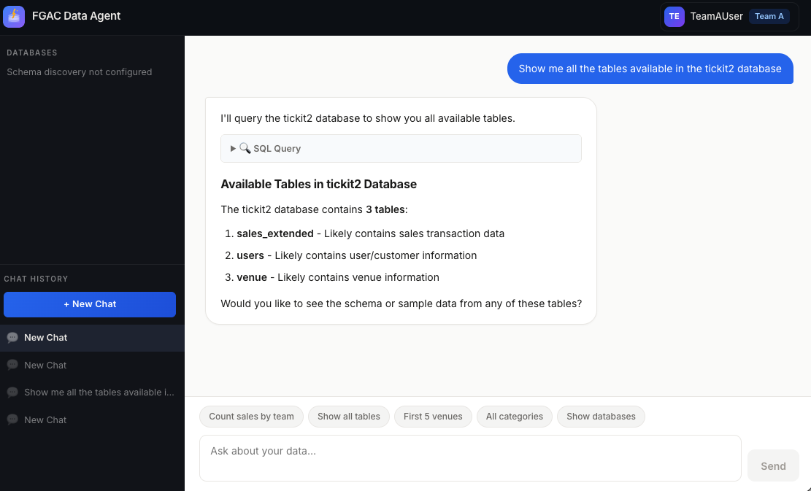

#### 1.3 Query the sales_extended Table and Count the Number of Rows Grouped by Team

In chatbot, enter `Query the sales_extended table and count the number of rows grouped by team`. You can click the **"Count sales by team"** button to prefill the prompt.

You can see `sales_extended` rows where `team = 'Team A'` only.

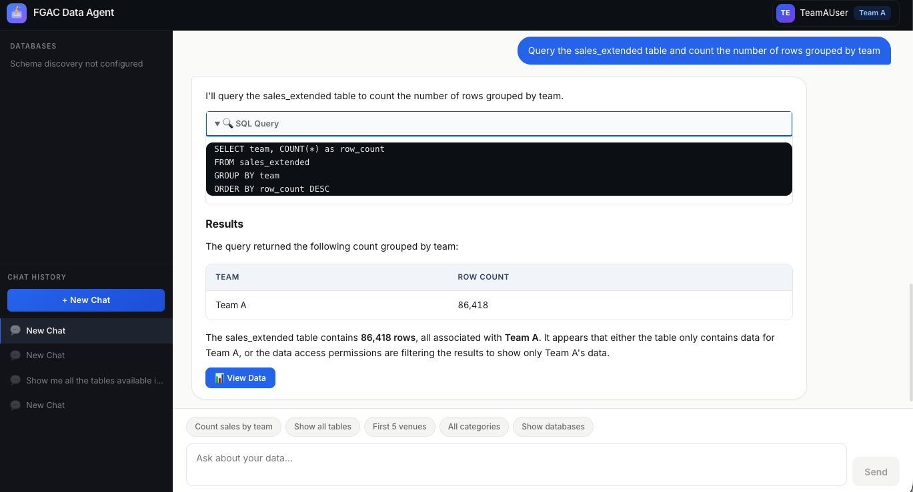

#### 1.4. Sign out Team A User

In top right corner, click the Sign Out button to log out. 

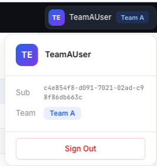
---

### 2. View TeamBUser Current Data Access

TeamBUser has `custom:team = "Team B"` which maps to the **TeamB IAM role**.

**Expected Access:**
- Can see `sales_extended` rows where `team = 'Team B'` only
- Can access `category` tables (TeamB tagged) and `users` table (shared tagged)
- Cannot access `venue` table (TeamA only)

#### 2.1 Log on TeamB User

Open another browser to http://localhost:3000. Log on Team B User. The username is defined in [cdk.json](backend/infra/cdk.json) (`TeamBUser`); the password is the value you exported as `TEAM_B_PASSWORD` before deployment.

#### 2.2 View What Tables Available to Team B User

In chatbot, enter `Show me all the tables available in the tickit2 database`. You can click the **"Show all tables"** button to prefill the prompt.

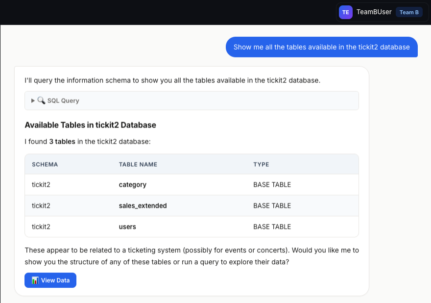

You can see `category`, `users` and `sales_extended`.

#### 2.3 Query the sales_extended Table and Count the Number of Rows Grouped by Team

In chatbot, enter `Query the sales_extended table and count the number of rows grouped by team`. You can click the **"Count sales by team"** button to prefill the prompt.

You can see `sales_extended` rows where `team = 'Team B'` only.

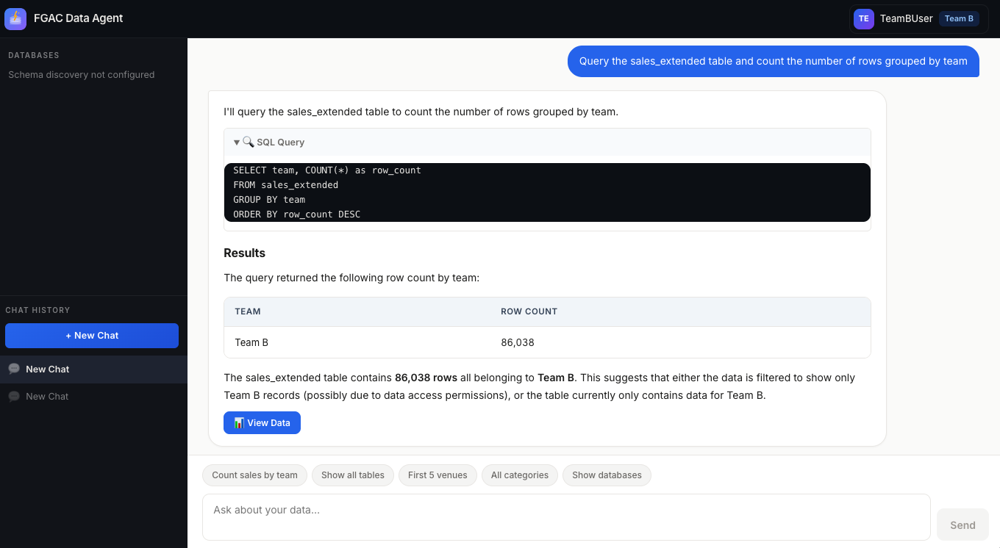

#### 2.4. Sign out Team B User

In top right corner, click the Sign Out button to log out. 

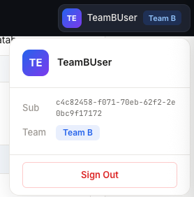

---

### 3. Grant Extra Access to Team A User

In Lake Formation, grant Team A user `sales_extended` table Team B records and table `category`.

#### Grant `ASSOCIATE` Permission on IAM Identity for LF Tag Management

1. In AWS Management Console, navigate to **Lake Formation > LF-Tags and permission**.

2. Navigate to tab **LF-Tag permissions** and choose **"Grant permissions"**.

3. In **Permission type**, choose **"LF-Tag key-value pair permissions"**.

   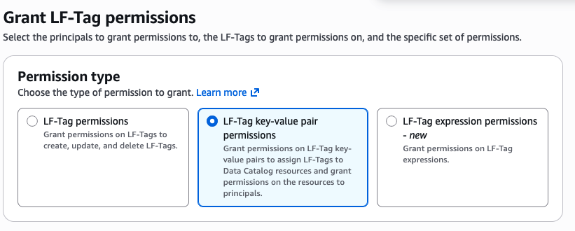

4. In **Principals**, choose the IAM identity you use to manage LF-Tag.

   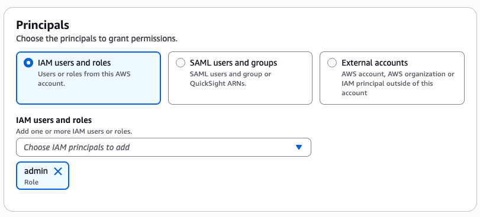

5. In **LF-Tags key-value pair permissions**, choose the tag `team` in key dropdown. Choose all values in Values dropdown. In **Permissions**, check `Associate`.

   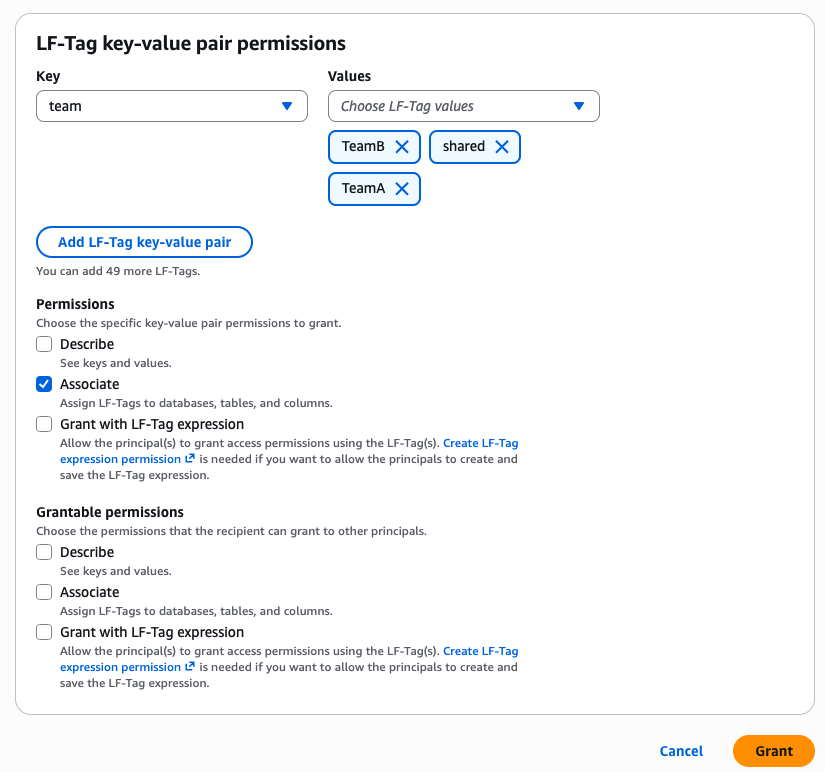

6. Click the **Grant** button.

#### Grant Team A with Category Table

1. Navigate to **AWS Lake Formation > Tables and Materialized Views**. Search for table `category` in database `tickit2`.

2. Choose **LF-Tags** tab and choose the **Edit LF-Tags** button.

   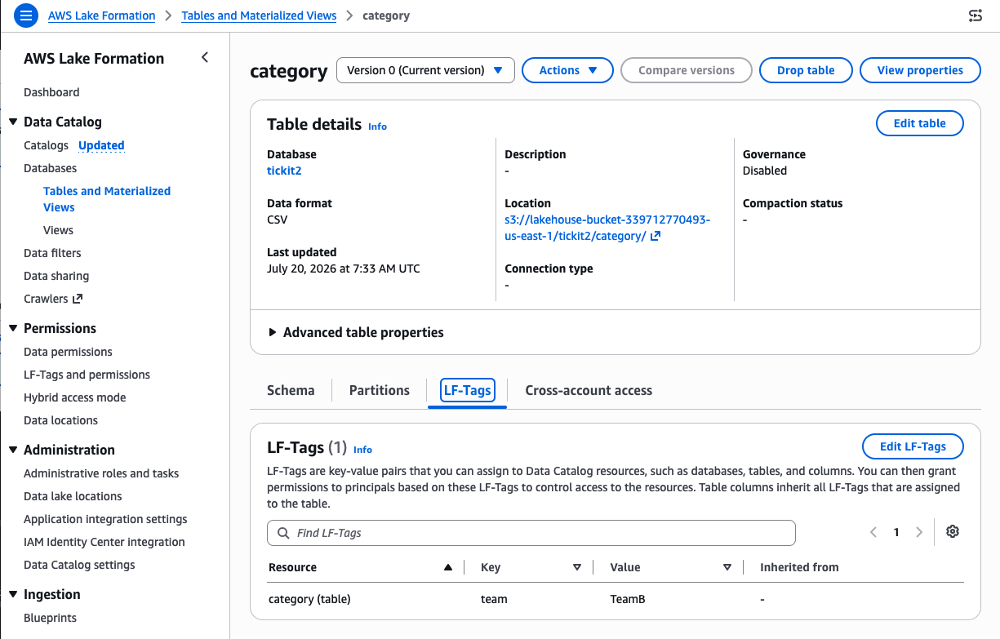

3. In values dropdown, change from `TeamB` to `shared` to grant table access to TeamA.

   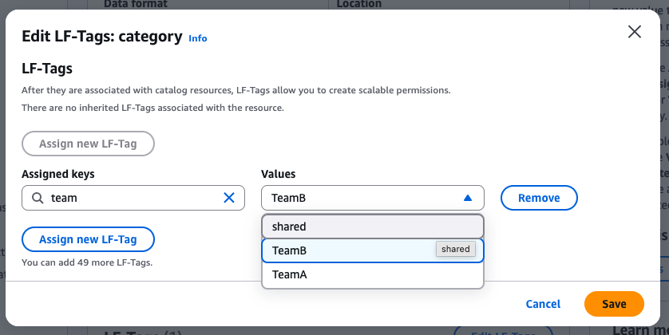

4. Choose **Save** to save the change.

#### Grant Team A with Team B's Row Access in sales_extended

1. Navigate to **AWS Lake Formation > Data filters**. Search for Filter named `TeamA-RowFilter`.

   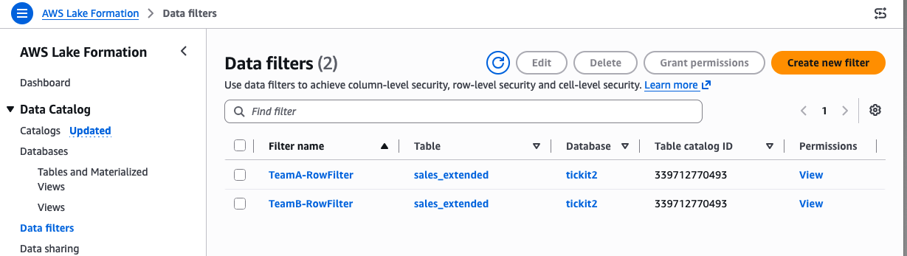

2. Choose **Edit** button.

3. Modify **Row filter expression** to `team = 'Team A' OR team = 'Team B'` to grant Team A users access to Team B's records in table `sales_extended`.

   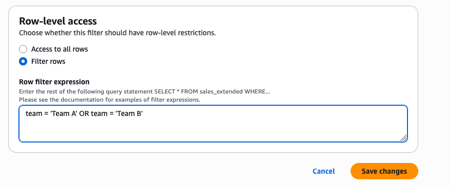

---

### 4. Check the Latest Granted Permission in Team A User

#### 4.1 Log on TeamA User

Navigate to http://localhost:3000. Log on Team A User. The username is defined in [cdk.json](backend/infra/cdk.json) (`TeamAUser`); the password is the value you exported as `TEAM_A_PASSWORD` before deployment.

#### 4.2 View What Tables Available to Team A User

In chatbot, enter `Show me all the tables available in the tickit2 database`.

Now you can also see `category`.

> **Note**: It may take several minutes for Lake Formation permissions to propagate.

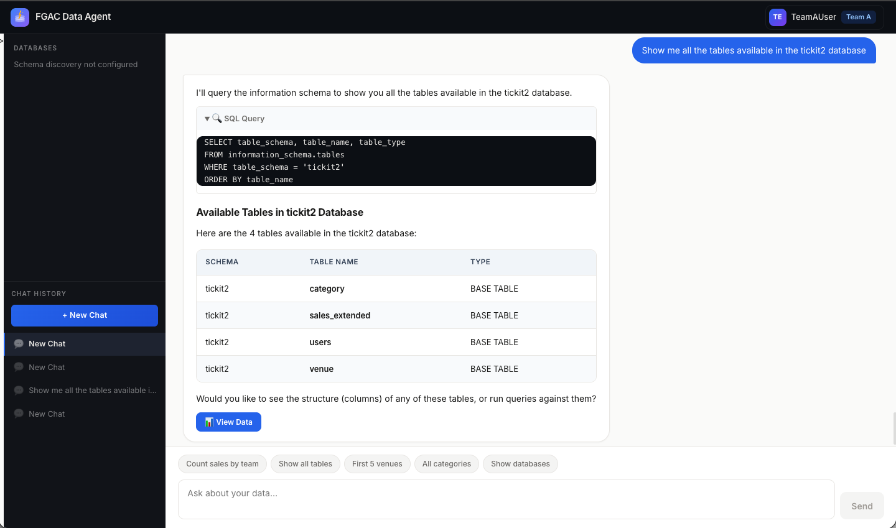

#### 4.3 Query the sales_extended Table and Count the Number of Rows Grouped by Team

In chatbot, enter `Query the sales_extended table and count the number of rows grouped by team`.

You can see `sales_extended` rows where `team = 'Team A'` and `Team B`.

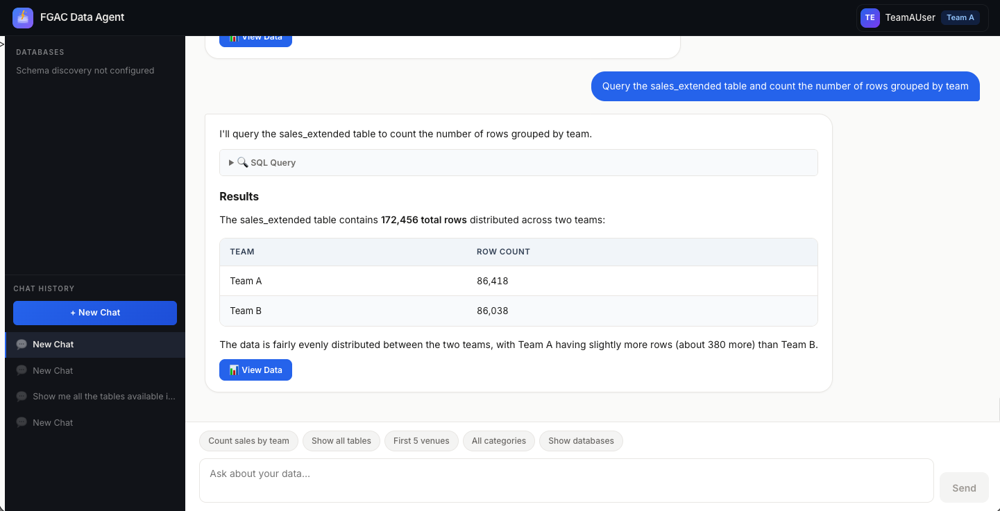

---

## Clean Up

Run the following command to remove all components generated:

```bash
uv run cdk destroy --all --profile <YOUR_PROFILE>
```

---

## Security Considerations

- **Principle of least privilege**: Lambda has no data permissions — only credential exchange capability
- **All data access flows through user-scoped credentials** with AWS Lake Formation enforcement
- **OAuth token validated** at Cognito level; IAM authentication at AgentCore Gateway level
- **Audit trail**: AWS CloudTrail + AWS Lake Formation audit logs trace data access to individual users
- **No tag injection risk**: Session tags derived from validated token claims via Identity Pool

---

## Conclusion

By combining Cognito User Pools (authentication), Identity Pools (token-to-credential exchange), and Lake Formation TBAC (declarative access control), you can build a data agent where:

- Each query is scoped to the authenticated user's identity
- The MCP Server Lambda acts as a credential broker with minimal permissions — not a data accessor
- Lake Formation enforces row and column-level security without any filtering logic in your application code
- The entire stack maintains an audit trail from user authentication to data access

The pattern works for scenarios where external users need scoped access to a data lake through an AI agent — SaaS analytics, partner portals, customer-facing dashboards, or multi-tenant data products.

---